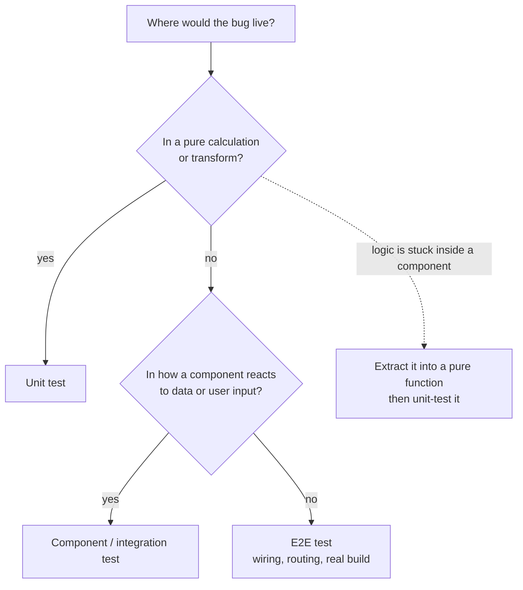

# 7.1 — Testing Fundamentals

> Module: 07 — Frontend Testing & Quality · First taught: 2026-09-14 · Last updated: 2026-09-14

## TL;DR
Manual testing proves an app worked **once**; an automated test is the same check written down so it re-runs on every change — the real payoff is being able to change code tomorrow without fear. Tests live at three levels (unit, integration/component, E2E) that trade **confidence for cost**, and the governing rule is to **push each test down to the lowest level that can still catch the bug**. Good tests assert **behavior the user experiences, not implementation details**, so they only go red when something is actually broken. Replace dependencies you don't control with **test doubles** (fake the boundary, don't mock your own internals), and spend testing effort on logic, boundaries, error states, critical flows, and fixed bugs — not on library internals, styling, or coverage numbers.

## Key Concepts

### Why test at all
A test is a question the code gets asked automatically on every change: *"do you still do what you promised?"* Clicking through an app by hand verifies it at one moment; the next commit can silently break it. Tests buy three things:

| Payoff | Meaning |
|---|---|
| **Confidence** | Ship without a manual click-through of every feature |
| **Regression safety** | Changing one feature doesn't silently break another |
| **Documentation** | Test names state what the app promises — and unlike a wiki page, they fail when the promise stops being true |

Architecturally, tests are what keep the **cost of change** flat over time. Without them, every change is risky, so teams stop touching old code, and the codebase slowly calcifies.

### The testing pyramid — confidence vs cost
| Level | What runs | Speed | When it fails, you learn… |
|---|---|---|---|
| **Unit** | One pure function in isolation | ~1 ms | Exactly which function, with which input |
| **Integration / component** | A component and its children, with a fake network | ~100 ms | Which feature broke |
| **E2E** | The real app in a real browser (routing, build, network wiring) | seconds | "Something, somewhere in this flow" |

Higher levels are more realistic but slower, flakier, more expensive to maintain, and less precise when they fail. The classic shape is **many unit tests, fewer integration tests, very few E2E tests**.

Why not make everything E2E, since it is the most realistic? Hundreds of E2E tests produce a suite that takes half an hour, fails randomly on network timing, and gives a red build that doesn't say where the problem is. The team stops trusting the suite — and then stops running it.

**The testing trophy (frontend variant).** Many React teams (following Kent C. Dodds) make the *integration* layer the largest: static checks → a thin layer of unit tests → a thick layer of integration tests → a few E2E tests. The reasoning is that most UI bugs do not live in pure functions; they live in the **wiring** — a component receives the wrong prop, a loading state never clears, an error never renders.

Pyramid and trophy agree on one rule:

> **Push each test down to the lowest level that can still catch the bug.**

- Bug lives in a calculation or transform → **unit**
- Bug lives in how a component reacts to data or user input → **component / integration**
- Bug lives in how the pieces are wired together (routing, lazy chunks loading, the real build) → **E2E**

**If you could only write one test**, make it a single E2E happy path through the app's core flow: it exercises routing, fetching, validation, rendering, and the build at once — the widest safety net any single test can give. That same breadth is exactly why you don't write hundreds of them.

**Testability shapes design.** If logic is tangled inside a component, the only way to test it is at the component level. The architect's response is not "then I'll test it there" — it's **"extract it into a pure function so it can be unit-tested."** Hard-to-test code is usually a signal of a missing boundary.

### Test behavior, not implementation
A test should fail **when the user's experience breaks — and only then.**

**Litmus test:** *"If I refactor without changing what the user sees, does this test go red?"* If yes, it is testing implementation.

A test that fails when nothing is broken is a **false alarm**. Every false alarm teaches the team that red probably means nothing — so eventually a real failure gets ignored too. Implementation-coupled tests also punish good refactors: swapping a data-fetching library behind a custom hook, or replacing a raw color class with a design token, changes nothing for the user but breaks every test that asserted on the old internals.

### Arrange–Act–Assert and test names
Every test has three parts:
1. **Arrange** — set up the input and the world
2. **Act** — perform the *one* thing under test
3. **Assert** — check the outcome

A test name should read like a promise the app makes, so a failure explains itself without opening the file:
- ❌ `it('works')`, `test('schema')`, `test('error state')`
- ✅ `it('shows "User not found" when the GitHub user does not exist')`

### Test doubles — replacing what you don't control
Real external dependencies make tests **slow** (network), **non-deterministic** (live data changes — a star count asserted today is wrong tomorrow), and **rate-limited or costly** (e.g. the unauthenticated GitHub API allows 60 requests per hour, which a CI suite exhausts fast). A **test double** stands in for the real dependency.

| Double | What it is | You assert on | Example |
|---|---|---|---|
| **Stub** | Returns a canned answer; doesn't care how it's called | The **outcome** | "The API always returns this 3-item JSON" |
| **Fake** | A lightweight but genuinely working implementation | The **outcome** | An MSW (Mock Service Worker) handler that answers `GET /users/:user/repos` and returns 404 for unknown users; an in-memory database |
| **Mock** | Records how it was called; the test verifies the calls | The **interaction** | `expect(trackEvent).toHaveBeenCalledWith('repo_viewed')` |

Tooling blurs the names — Vitest calls all of these "mocks" (`vi.fn()`, `vi.mock()`). The meaningful distinction is **what the test asserts**: an outcome (stub/fake) or an interaction (mock).

**Rule: fake the boundaries you don't own** (network, clock, randomness, third-party services); **don't mock your own internals.** Mocking your own hook or module couples the test to implementation. Mocks are the right tool only when **the call itself is the behavior** — an analytics event fired, a payment API called exactly once — because there is no visible outcome to check.

### What is (and isn't) worth testing
| ✅ Worth it | ❌ Not worth it |
|---|---|
| Business logic and data transforms (formatting, sorting, aggregates) | Third-party library internals (e.g. that a query library caches) — its maintainers test that |
| Trust boundaries (schema validation of incoming data) | Styling, CSS/Tailwind classes, static markup |
| Error, empty, and loading states — the paths nobody clicks manually | Implementation details: state variable names, which hook was called |
| The 1–3 critical flows that make the app worth existing (E2E) | Chasing 100% coverage |
| **Every bug you fix** — a regression test that would have caught it | |

**Coverage** measures lines *executed*, not behavior *verified* — a test with no assertions at all can reach 100%. Use coverage to discover untested areas, never as a target.

## Examples

### A GitHub repository dashboard, classified by level
Consider a dashboard that fetches a user's repositories from the GitHub API, validates the response with a Zod schema, shows metric tiles, handles a "user not found" error, and has a lazily-loaded Insights tab.

| Feature | Level | Why |
|---|---|---|
| A helper that formats `1500` as `"1.5k"` | **Unit** | The bug would live in a pure function; edge cases (`0`, `999`, `1000`, `1_000_000`) are the whole point and cost milliseconds to check |
| The schema rejects a repo whose `stargazers_count` is a string | **Unit** | Pure validation logic — no rendering needed |
| "User not found" message appears when the API returns 404 | **Component** | The bug would live in how the UI reacts to a response; fake the network |
| Type a username → see stats → open Insights tab → chart appears | **E2E** | The bug would live in the wiring: routing, lazy chunk, real build |

### Unit test with Arrange–Act–Assert
```ts
it('rejects a repo whose stargazers_count is not a number', () => {
  // Arrange — set up the input
  const payload = { name: 'query', stargazers_count: 'lots' };
  // Act — do the one thing under test
  const result = repoSchema.safeParse(payload);
  // Assert — check the outcome
  expect(result.success).toBe(false);
});
```
A manual "simulate a broken payload" click-through proves this once; the test proves it in ~1 ms on every commit.

### Brittle vs resilient assertions
```tsx
// ❌ Brittle — asserts HOW the code works
expect(useRepoStats).toHaveBeenCalledWith('tanstack');           // mocks your own hook
expect(container.querySelector('.text-red-600')).not.toBeNull(); // asserts a Tailwind class

// ✅ Resilient — asserts WHAT the user experiences
expect(await screen.findByText(/user not found/i)).toBeInTheDocument();
```

A code-review comment on the brittle version, in problem → consequence → who-pays shape:
> *These tests check how the code is implemented instead of what the user sees. So when someone renames the hook or swaps `text-red-600` for a design token, the tests go red even though the user still sees the same error message — and the developer doing that refactor pays, losing time fixing tests that were never broken, while the team learns to read red as noise and eventually ignores a real failure.*

## Diagrams

```
            ▲  more realistic · slower · flakier · less precise
           ╱ ╲
          ╱E2E╲          few   — critical user flows, real browser
         ╱─────╲
        ╱ integ-╲        some  — component + children, faked network
       ╱ ration  ╲
      ╱───────────╲
     ╱    unit     ╲     many  — pure functions, milliseconds
    ╱───────────────╲
       ▼  faster · cheaper · pinpoints the failure

  Rule: push each test DOWN to the lowest level that can still catch the bug.
```



## Common Pitfalls
- **Picking a level one step too high.** A common mistake is placing pure formatting or calculation logic at the component/integration level because it is *displayed* by a component. Where the logic is displayed doesn't matter — where the bug would *live* does.
- **Making everything E2E "because it's most realistic."** The suite becomes slow and flaky, failures don't localize, and the team stops trusting and running it.
- **Asserting on implementation details** — class names, state variable names, which internal hook or function was called. These tests break on harmless refactors and turn the suite into a false-alarm generator.
- **Mixing up which side is the problem** when reviewing brittle tests: asserting on a CSS class is the *problem*; asserting on the text the user sees is the *fix*.
- **Mocking your own modules** instead of faking the external boundary (network, clock). This recreates implementation coupling one layer down.
- **Hitting real third-party APIs in the suite** — slow, rate-limited, and non-deterministic, so tests fail for reasons unrelated to the code.
- **Treating coverage as a goal.** High coverage with weak assertions verifies nothing.
- **Vague test names** (`it('works')`) that force the next developer to open the file to understand what broke.

## Quick Recall
1. What does an automated test give you that a careful manual check does not?
2. A helper formats large numbers (`1500 → "1.5k"`). Which pyramid level should test it, and what's the one question that decides it?
3. State the litmus test for "this test is coupled to implementation," and explain why such tests eventually make a team ignore real failures.
4. What is the real difference between a stub/fake and a mock — and when is a mock the right choice?
5. If you could write only one test for a whole app, which level would you choose, and why is that same reason an argument against writing hundreds of them?

<details>
<summary>Answers</summary>

1. It re-runs the same check on every change for free, so regressions are caught automatically — confidence to ship, safety to refactor, and documentation that fails when it goes stale.
2. Unit. Ask *where the bug would live* — here, in a pure function. (If the logic is buried inside a component, extract it so it can be unit-tested.)
3. "If I refactor without changing what the user sees, does this test go red?" Such tests produce false alarms; repeated false alarms teach the team that red means "probably nothing," so a genuine failure gets dismissed.
4. Stubs/fakes are asserted through the **outcome**; mocks are asserted through the **interaction** (how they were called). Use a mock only when the call itself is the behavior (analytics event, payment call) and there's no visible outcome to check.
5. One E2E happy path — it exercises the most wiring per test. That breadth is also what makes E2E slow, flaky, and imprecise, so a suite of hundreds becomes untrustworthy.

</details>
