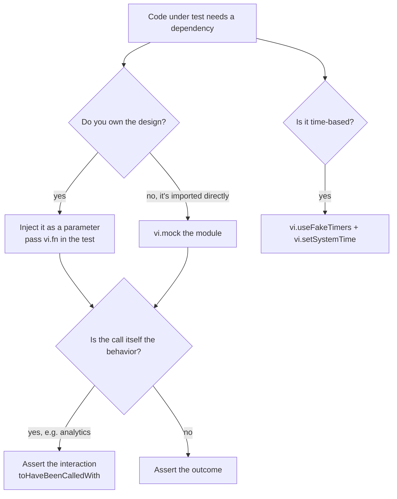

# 7.2 — Unit Testing (Vitest)

> Module: 07 — Frontend Testing & Quality · First taught: 2026-09-14 · Last updated: 2026-09-14

## TL;DR
Vitest is a test runner that reuses a Vite project's own config and transform pipeline, so tests compile the same code the app ships — no second Babel/ts-jest setup to drift. A unit test is `describe` (a group) → `it` (one promise) → `expect(actual).matcher(expected)`, and its real value comes from **choosing the inputs**: comfortable middle-of-range values pass while the bugs sit at boundaries, so edge cases belong in `it.each` tables. Keep tests independent with `beforeEach`/`afterEach`, replace what you don't control with `vi.fn()` (preferably injected) or `vi.mock()` (when you can't inject), and freeze the clock with fake timers. Coverage tells you what is *definitely untested*, never what is *tested well* — so it is a review signal, not a target.

## Key Concepts

### Why Vitest (and not Jest) in a Vite project
A Vite app already has a pipeline that turns TypeScript, path aliases (`@/lib`), and ESM into running code. Vitest reads the same `vite.config.ts` and uses the same transforms. Jest in a Vite project needs its own parallel configuration (Babel or ts-jest, module-name mapping for aliases, ESM flags) — and **a test pipeline that differs from the build pipeline can pass on code that isn't what ships.** Vitest's API is Jest-compatible (`describe`/`it`/`expect`, `vi` ≈ `jest`), so migration is cheap.

### Setup
```bash
npm i -D vitest
```
```jsonc
// package.json → "scripts"
"test": "vitest",          // watch mode — interactive, for development
"test:run": "vitest run"   // single run, exits with a code — for CI
```
- For pure logic, no extra config is needed; the default environment is Node. A DOM environment (`jsdom`) is only needed once components are rendered.
- Files named `*.test.ts` are discovered automatically. Colocate them: `src/lib/formatCount.ts` ↔ `src/lib/formatCount.test.ts`.
- Import `describe`/`it`/`expect`/`vi` from `'vitest'` explicitly rather than enabling `globals: true` — TypeScript then knows where they come from with no `tsconfig` changes.

### Anatomy of a test file
```ts
import { describe, it, expect } from 'vitest';
import { formatCount } from './formatCount';

describe('formatCount', () => {                        // group — its name prefixes every result line
  it('leaves numbers under 1,000 unchanged', () => {   // one promise the function makes
    expect(formatCount(42)).toBe('42');                // actual → matcher → expected
  });
});
```
The result reads as a sentence — *"formatCount › leaves numbers under 1,000 unchanged"* — so a failure explains which promise broke before anyone opens the file. This is Arrange–Act–Assert at its smallest.

### Matchers
| Matcher | Checks | Watch out |
|---|---|---|
| `toBe(x)` | Same primitive value or same reference (`Object.is`) | Two identical object literals are **not** `toBe` each other |
| `toEqual(x)` | Deep structural equality | Ignores `undefined`-valued keys |
| `toStrictEqual(x)` | Deep equality including `undefined` keys and class type | Use when exact shape matters |
| `toMatchObject(x)` | Actual contains this subset | Useful for large API payloads |
| `toThrow(msg?)` | The function throws | Pass a **function**: `expect(() => parse(bad)).toThrow()` |
| `rejects.toThrow()` | A promise rejects | `await expect(promise).rejects.toThrow(ErrorClass)` |
| `toBeCloseTo(n)` | Floating-point numbers | `0.1 + 0.2` is not `toBe(0.3)` |

Rule of thumb: **`toBe` for primitives, `toEqual` for objects.**

### Edge-case tables with `it.each`
Happy-path inputs rarely find bugs. A table makes every boundary a one-line promise:
```ts
it.each([
  { input: 0,         expected: '0' },
  { input: 999,       expected: '999' },   // just below the threshold
  { input: 1_000,     expected: '1k' },    // exactly on it
  { input: 999_950,   expected: '1M' },    // rounding carries across the next threshold
  { input: 1_000_000, expected: '1M' },
])('formats $input as "$expected"', ({ input, expected }) => {
  expect(formatCount(input)).toBe(expected);
});
```
`$input` / `$expected` are interpolated into the test name, so the failure line names the exact case.

**Where edge cases hide:**
1. **Zero and empty** — `0`, `''`, `[]`
2. **Boundaries** — just below, exactly on, just above every threshold in the code
3. **Rounding / carry-over** — formatting that pushes a value across a boundary
4. **Invalid or unexpected input** — negatives, `NaN`, `null` from an API. Whether `-1500` should format as `"-1.5k"` is a *product decision*; the test is where that decision gets written down.

### Tests as executable architecture decisions
A unit test can pin a design choice so a later "improvement" can't silently reverse it:
```ts
it('accepts extra fields a third-party API may add later', () => {
  expect(repoSchema.safeParse({ ...validRepo, new_field: 1 }).success).toBe(true);
});
```
This does not test the validation library — it tests *the decision* not to make the schema strict for a cooperative external API. If someone adds `.strict()`, the test goes red and the reasoning is defended automatically.

### Watch mode
`vitest` (no `run`) watches files and uses the import graph to re-run **only the tests affected by a saved file**, typically in well under a second. Keys: `p` filter by filename, `t` filter by test name, `a` re-run all. This makes refactoring safe in a tight loop: restructure the code, save, and **green means behavior is preserved**.
- `it.only` / `it.skip` help while debugging. Vitest fails the run in CI when `.only` is present, because a committed `.only` silently disables the rest of the suite.
- `vitest run` runs once and exits; Vitest also switches to run mode automatically when the `CI` environment variable is set.

### Test isolation: `beforeEach` / `afterEach`
**Every test must pass alone and in any order.** If a test passes only because another ran first, it will fail mysteriously when run in isolation or reordered.
```ts
let fetchStub: ReturnType<typeof vi.fn>;

beforeEach(() => {
  fetchStub = vi.fn();        // fresh double per test — no leftover call history
});

afterEach(() => {
  vi.useRealTimers();         // undo global changes
  vi.restoreAllMocks();       // restore originals replaced by vi.spyOn
});
```
- `beforeEach` **builds fresh state**; `afterEach` **undoes global side effects** (timers, spies, stubbed globals, env vars).
- `beforeAll` is only for expensive setup that tests **read but never modify**.

### `vi.fn()` — an injected test double
When a dependency is a parameter, a test can hand in a double directly:
```ts
export async function fetchRepos(username: string, fetchImpl: typeof fetch = fetch) {
  const res = await fetchImpl(`https://api.github.com/users/${encodeURIComponent(username)}/repos`);
  if (res.status === 404) throw new UserNotFoundError(username);
  if (!res.ok) throw new Error(`GitHub responded ${res.status}`);
  return z.array(repoSchema).parse(await res.json());
}
```
```ts
const respond = (body: unknown, status = 200) =>
  vi.fn().mockResolvedValue(new Response(JSON.stringify(body), { status }));

it('throws UserNotFoundError on 404', async () => {
  await expect(fetchRepos('no-such-user', respond({}, 404))).rejects.toThrow(UserNotFoundError);
});
```
| Configure the double | Assert on it (only when the call *is* the behavior) |
|---|---|
| `.mockReturnValue(x)` | `toHaveBeenCalledTimes(n)` |
| `.mockResolvedValue(x)` / `.mockRejectedValue(err)` | `toHaveBeenCalledWith(...args)` |
| `.mockImplementation(fn)` | `.mock.calls` (raw call list) |

Asserting only on the returned outcome makes the double a **stub**; asserting on how it was called makes it a **mock**.

**Design lesson:** the default parameter `fetchImpl = fetch` is dependency injection in its smallest form — production never passes it, tests always do. This is the Dependency Inversion idea (the "D" in SOLID) at function scale. **Code that is hard to test is usually telling you about a missing seam.**

### `vi.mock()` — replacing a module you import
When code imports a dependency directly and restructuring isn't appropriate:
```ts
import { vi, it, expect } from 'vitest';
vi.mock('./analytics', () => ({ track: vi.fn() }));   // replaces the whole module for this file

import { track } from './analytics';
import { openRepo } from './openRepo';

it('reports which repo was opened', () => {
  vi.stubGlobal('open', vi.fn());
  openRepo('tanstack/query');
  expect(vi.mocked(track)).toHaveBeenCalledWith('repo_opened', { repo: 'tanstack/query' });
});
```
- **`vi.mock` is hoisted** above all imports, regardless of where it is written — that is how the replacement exists before the code under test imports it.
- Because of hoisting, the factory **cannot reference variables declared in the test file**; use `vi.hoisted(() => …)` when it must.
- `vi.mocked(x)` is a type-only cast so mock properties and matchers type-check.

**Preference:** inject and use `vi.fn()` when you own the design; reach for `vi.mock()` for modules you can't restructure. `vi.mock` swaps modules invisibly, which makes it the easiest way to end up mocking your own internals — a file with many `vi.mock` calls against its own modules is testing wiring, not behavior.

### Fake timers — controlling the clock
Anything based on `Date.now()` or `setTimeout` is non-deterministic unless time is frozen:
```ts
beforeEach(() => {
  vi.useFakeTimers();
  vi.setSystemTime(new Date('2026-09-14T12:00:00Z'));
});
afterEach(() => vi.useRealTimers());

it.each([
  { pushed: '2026-09-14T11:59:30Z', expected: 'just now' },
  { pushed: '2026-09-11T12:00:00Z', expected: '3 days ago' },
])('shows $expected for $pushed', ({ pushed, expected }) => {
  expect(formatRelativeTime(pushed)).toBe(expected);
});
```
A fixed *input* timestamp is fine — the problem is the real *"now"* it is compared against. `vi.advanceTimersByTime(ms)` fast-forwards `setTimeout`/`setInterval`, e.g. to test a debounced search without waiting.

### Reading coverage
```bash
npm i -D @vitest/coverage-v8
npx vitest run --coverage     # add coverage/ to .gitignore
```
```
File            | % Stmts | % Branch | % Funcs | % Lines | Uncovered Line #s
formatCount.ts  |   100   |   100    |   100   |   100   |
fetchRepos.ts   |  88.9   |   75     |   100   |  88.9   | 9
```
- Read **`Uncovered Line #s`** first — each is a concrete candidate for a missing test (here, the non-404 error branch).
- **Branch %** is more informative than line % — a single-line ternary can be fully "line covered" with half its branches never run.
- `coverage/index.html` highlights unexecuted code in the source.
- **100% coverage does not mean correct.** Coverage proves a line ran, not that it produced the right answer for every input that reaches it.

### Coverage as a gate — Goodhart's law
> *"When a measure becomes a target, it ceases to be a good measure."*

A hard rule like "CI fails below 90%" rewards the cheapest way to raise the number: tests that execute lines but assert little or nothing. The team then maintains tests that protect nothing, and users get bugs the "90% covered" dashboard hid — while the green number discourages anyone from looking.

Healthier alternatives:
- Treat coverage as a **review signal**: look at uncovered lines in the diff and ask whether that branch deserves a test.
- If a gate is required, use a **ratchet** (never drop below the current level) rather than an arbitrary target.
- Gate on what actually protects users: **every bug fix ships with a regression test.**

## Examples

### A formatter that passes happy-path tests and still ships a bug
```ts
export function formatCount(n: number): string {
  if (n < 1_000) return String(n);
  if (n < 1_000_000) return `${(n / 1_000).toFixed(1).replace(/\.0$/, '')}k`;
  return `${(n / 1_000_000).toFixed(1).replace(/\.0$/, '')}M`;
}
```
Tests for `42 → "42"`, `1500 → "1.5k"`, and `2_500_000 → "2.5M"` all pass and reach **100% line and branch coverage**. Yet `formatCount(999_950)` returns `"1000k"`: the threshold is checked on the raw number, and `toFixed(1)` then rounds `999.95` up to `1000.0`. Only a boundary row in an `it.each` table exposes it:
```
✗ formatCount > formats 999950 as "1M"
  AssertionError: expected '1000k' to be '1M'
```

### A clock-dependent test that passes today
```ts
it('shows days ago', () => {
  expect(formatRelativeTime('2026-09-11T12:00:00Z')).toBe('3 days ago');   // no frozen clock
});
```
Green on the day it's written; tomorrow it computes "4 days ago" and CI fails with no code change — whoever opens the next PR loses time on a failure they didn't cause. Fix: `vi.useFakeTimers()` + `vi.setSystemTime(...)`.

## Diagrams



```
Watch-mode refactor loop

  save file ──► Vitest follows import graph ──► re-runs affected tests (<1s)
      ▲                                                   │
      │                green = behavior preserved         │
      └──────────── keep refactoring ◄────────────────────┘
                         red = you changed behavior → fix or update the promise
```

## Common Pitfalls
- **Testing only comfortable middle-of-range inputs.** Bugs concentrate at thresholds and where rounding meets a boundary.
- **Using `toBe` on objects or arrays** — it compares references; use `toEqual`.
- **`expect(fn()).toThrow()`** — the function throws before `expect` runs; wrap it: `expect(() => fn()).toThrow()`. For async code use `await expect(promise).rejects.toThrow()`.
- **Tests that depend on execution order** or shared mutable state — create fresh state in `beforeEach`.
- **Leaving fake timers, spies, or stubbed globals active** after a test — undo them in `afterEach`.
- **Depending on the real clock** — "3 days ago" assertions break the next day.
- **Referencing test-file variables inside a `vi.mock` factory** — the factory is hoisted above them; use `vi.hoisted`.
- **Mocking your own modules with `vi.mock`** instead of injecting or faking the external boundary.
- **Committing `it.only`** — it silently disables the rest of the suite locally (and fails the run in CI).
- **Treating 100% coverage as proof of correctness**, or making a coverage percentage a hard CI gate.

## Quick Recall
1. Why does sharing Vite's transform pipeline matter for test trustworthiness, not just setup convenience?
2. Name the four places to look for edge cases, and explain how a formatter can reach 100% coverage while still returning a wrong value.
3. What belongs in `beforeEach` versus `afterEach`, and what failure appears when tests aren't isolated?
4. When do you inject a `vi.fn()` versus use `vi.mock()` — and why can't a `vi.mock` factory use variables from the test file?
5. A team proposes failing CI below 90% coverage. What goes wrong, who pays, and what would you propose instead?

<details>
<summary>Answers</summary>

1. If tests compile code differently from the production build, tests can pass on code that differs from what ships. One pipeline means the tested code is the shipped code.
2. Zero/empty values, boundaries (below/on/above thresholds), rounding/carry-over, and invalid input. Coverage only records that lines executed; happy-path inputs can execute every line without ever hitting the boundary value that produces the wrong result.
3. `beforeEach` builds fresh state (new doubles, fresh data); `afterEach` undoes global changes (real timers, restored spies, unstubbed globals). Without isolation, tests pass or fail depending on order and break when run alone.
4. Inject when you control the design (clearer, no hidden module swap); `vi.mock` when the code imports the dependency directly and restructuring isn't appropriate. `vi.mock` is hoisted above all imports and declarations, so the variables don't exist yet when the factory runs — use `vi.hoisted`.
5. Goodhart's law: developers write the cheapest tests that raise the number with weak or no assertions. The team pays to maintain tests that protect nothing, and users pay for bugs hidden behind a reassuring percentage. Propose coverage as a review signal, a non-decreasing ratchet if a gate is needed, and a regression test required for every bug fix.

</details>
