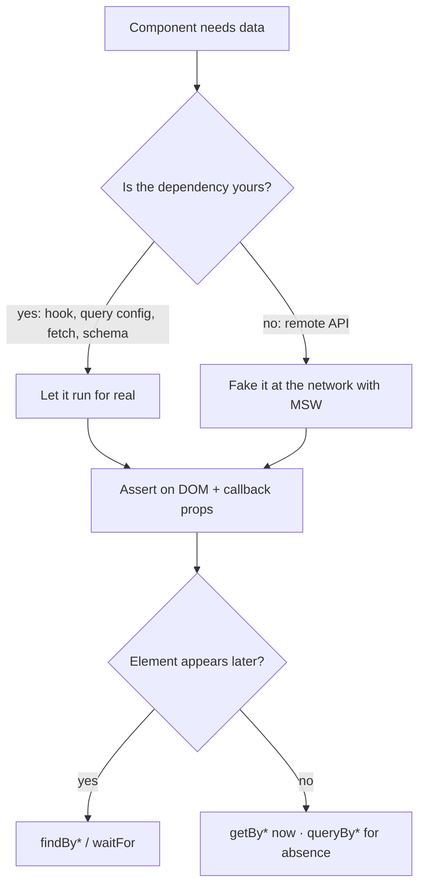

# 7.3 — Component Testing (React Testing Library)

> Module: 07 — Frontend Testing & Quality · First taught: 2026-09-14 · Last updated: 2026-09-15

## TL;DR
A component test renders a real component in a simulated DOM (`jsdom`) and checks it **only through the surfaces a user or a parent can touch**: props and user actions go in; rendered DOM and callback-prop calls come out. React Testing Library (RTL) enforces this by giving no access to state or props — you find elements the way people do, by **role and accessible name**, so a query that fails often means assistive technology can't find the element either. Async UI is handled with `findBy*` (wait for a condition), never with fixed sleeps. Data should be faked **at the network boundary** (MSW) rather than by mocking your own data hook, so your query, fetch, and schema code run for real in every test.

## Key Concepts

### What a component test touches
| In | Out |
|---|---|
| Props | The DOM it renders (what users see and operate) |
| User actions (typing, clicking) | Callback props it calls (what the parent sees) |

Everything else — `useState`, hooks, CSS classes, child component names — is implementation. A test that reaches into those breaks on a harmless refactor (a false alarm) while behavior stays correct.

Component tests sit in the thick middle of the testing trophy: ~100 ms each, no real browser, yet they catch real wiring bugs — a label not connected to its input, an error message that never renders, a submit button outside the form that isn't linked to it.

### Setup (Vitest + RTL)
```bash
npm i -D @testing-library/react @testing-library/dom @testing-library/user-event @testing-library/jest-dom jsdom
```
```ts
// vitest.config.ts
import { defineConfig } from 'vitest/config';
import react from '@vitejs/plugin-react';

export default defineConfig({
  plugins: [react()],
  test: {
    environment: 'jsdom',                 // simulated DOM inside Node
    setupFiles: ['./src/test/setup.ts'],
  },
});
```
```ts
// src/test/setup.ts
import '@testing-library/jest-dom/vitest';   // toBeInTheDocument, toHaveTextContent, ...
import { afterEach } from 'vitest';
import { cleanup } from '@testing-library/react';

afterEach(cleanup);   // RTL only auto-cleans when Vitest `globals` is enabled
```
Without `cleanup`, the next test still sees the previous test's DOM — an isolation bug.

### Queries: two dimensions
**Which variant — what happens when nothing matches?**

| Variant | 0 matches | >1 match | Use for |
|---|---|---|---|
| `getBy*` | throws | throws | Something that must be there **now** |
| `queryBy*` | returns `null` | throws | Asserting something is **absent** |
| `findBy*` | rejects after timeout (~1 s) | rejects | Something that **will appear** (async) |

Each has an `*AllBy*` form returning an array.

**Which query — priority order:**
1. `getByRole` — how assistive technology sees the page (the accessibility tree)
2. `getByLabelText` — form fields
3. `getByPlaceholderText`, `getByText`, `getByDisplayValue`
4. `getByAltText`, `getByTitle`
5. `getByTestId` — last resort; invisible to users

**`getByRole` is a free accessibility check.** If `getByRole('button', { name: /search/i })` can't find the button, a screen-reader user can't either — the test and the accessibility requirement become one assertion. When a query fails, RTL prints every accessible role in the DOM; `screen.debug()` dumps the HTML.

### Scoping with `within`
When the same accessible name legitimately appears more than once (a "Delete" button on every table row), scope the search:
```ts
const row = await screen.findByRole('row', { name: /warehouse manager/i });
await user.click(within(row).getByRole('button', { name: 'Delete' }));
```
If the same name appears multiple times **without** a distinguishing container, that's usually an accessibility bug, not a test problem (see Examples).

### `userEvent` over `fireEvent`
- `fireEvent.change(input, { target: { value: 'x' } })` dispatches **one** synthetic event and sets the value directly.
- `await user.type(input, 'x')` behaves like a person: focus, then keydown / keypress / input / keyup **per character**, respecting `disabled`, `maxLength`, and `pointer-events: none`.

`fireEvent` can "click" things a real user can't, producing a passing test for a broken UI. Call `userEvent.setup()` **before** `render`, and `await` every action.

### jest-dom matchers worth knowing
`toBeInTheDocument` · `toHaveTextContent` · `toBeVisible` · `toBeDisabled` / `toBeEnabled` · `toBeChecked` · `toBePartiallyChecked` (`aria-checked="mixed"`) · `toBeInvalid` (`aria-invalid`) · `toHaveAccessibleName` · `toHaveAccessibleDescription` (`aria-describedby` wiring) · `toHaveValue` · `toHaveAttribute`

These assert what assistive technology perceives — not class names.

### Callback props are outputs
```ts
expect(onSearch).toHaveBeenCalledWith('tanstack');
```
This does not contradict "don't assert on calls". A callback prop is part of the component's public contract — it's how the component talks to its parent. Asserting that it fired with the right value is testing behavior. Asserting that an internal setter or hook ran is testing implementation.

With React Hook Form, `handleSubmit` calls `onSubmit(values, event)` asynchronously — wait for it, then inspect the first argument:
```ts
await waitFor(() => expect(onSubmit).toHaveBeenCalledTimes(1));
expect(onSubmit.mock.calls[0][0]).toEqual({ name: 'Warehouse manager', permissionIds: [id] });
```

### Async UI: `findBy*` and `waitFor`
| Tool | Behavior | Use for |
|---|---|---|
| `await screen.findByRole(...)` | Retries `getBy` until it matches or ~1 s passes | **Default** for "this will appear" |
| `await waitFor(() => expect(...))` | Retries any assertion until it passes | Non-query checks (a callback fired, an element is gone) |
| `await waitForElementToBeRemoved(...)` | Waits for disappearance | A loading indicator going away |

`waitFor` rules: don't wrap a `getBy` in it (that's `findBy`); never put side effects like `user.click` inside (they re-run on every retry); one assertion per `waitFor`.

**Never replace these with a fixed sleep.** `await new Promise(r => setTimeout(r, 500))` does not wait *until* the element exists — it waits exactly 500 ms regardless. On a slow CI machine the element arrives at 600 ms and the test fails with no code change (flaky); on a fast one it arrives at 5 ms and every run wastes the remaining time. A condition wait finishes as soon as the condition is true.

### Where to fake the data
The data path of a typical screen:
```
<Dashboard> → useRepoStats() → TanStack Query → fetch → Zod schema → Third-party API
  (yours)       (yours)        (config yours)  (yours)    (yours)       (NOT yours)
```
- **`vi.mock('./useRepoStats')`** returning canned data deletes everything in the middle from the test — retry policy, schema validation, error mapping. Two failure directions:
  - **False green:** the API renames a field, the schema rejects every real response, and the test stays green because the schema never runs. Confidence → merge → users hit the bug in production, and the team debugs it there.
  - **False red:** a harmless refactor changes the hook's return shape; every mocked test breaks while the app still works.
- **MSW (Mock Service Worker)** intercepts the HTTP request itself. All your code runs; only the part you don't own is faked. This is the "fake the boundaries you don't own, don't mock your own internals" rule applied. Refactor the hook freely — the tests don't change.

### MSW setup (v2)
```ts
// src/test/server.ts
import { http, HttpResponse } from 'msw';
import { setupServer } from 'msw/node';

export const REPOS = 'https://api.github.com/users/:username/repos';

export const server = setupServer(
  http.get(REPOS, () => HttpResponse.json([repoFixture()])),   // default = happy path
);
```
```ts
// src/test/setup.ts (additions)
beforeAll(() => server.listen({ onUnhandledRequest: 'error' }));  // accidental real request = loud failure
afterEach(() => server.resetHandlers());                          // undo per-test overrides
afterAll(() => server.close());
```
Per-test override:
```ts
server.use(http.get(REPOS, () => HttpResponse.json({ message: 'Not Found' }, { status: 404 })));
```
Build fixtures with a factory that **parses through the real schema**, so a fixture that drifts from the schema fails loudly instead of testing an impossible shape.

### Stub handlers vs a fake backend
A handler that always returns the same list is a **stub**. For flows that mutate data, an in-memory **fake** is more useful: POST pushes into an array, GET returns the array, DELETE removes from it, and the array resets in `beforeEach`. Now "create → cache invalidation → refetch → new row appears" is testable end to end, and assertions can check what the server *stored* rather than how a mutation function was called.

To check a request payload (the contract with the backend), capture it in an overriding handler:
```ts
let received: unknown;
server.use(http.post(`${API}/roles`, async ({ request }) => {
  received = await request.json();
  return HttpResponse.json({ data: { item: roleFixture() } }, { status: 201 });
}));
await createRole({ name: 'Auditor', description: '', permissionIds: [] });
expect(received).not.toHaveProperty('description');   // empty description is omitted, not sent as ""
```

### A fresh QueryClient per test
```tsx
export function renderWithClient(ui: ReactElement) {
  const client = new QueryClient({ defaultOptions: { queries: { retry: false } } });
  return render(<QueryClientProvider client={client}>{ui}</QueryClientProvider>);
}
```
- **New client per test:** a shared client shares its cache — the second test gets data instantly and never shows a loading state, an isolation bug that looks like a pass.
- **`retry: false`** keeps error tests fast. Edge case: **per-query `retry` options override client defaults.** If a hook retries 5xx responses itself, a 5xx test will retry with real backoff (1 s, 2 s) and exceed `findBy`'s timeout — inject a short `retryDelay` or raise that one `findBy` timeout. The test is then exercising the real retry policy.

### Component libraries in jsdom
Real apps often use a UI library (e.g. Ant Design). Common adjustments:
- **`window.matchMedia` doesn't exist in jsdom.** Libraries that read breakpoints need a shim. A shim that answers `false` to everything simulates a *phone*, which may collapse row actions into a menu and make buttons unfindable — evaluate `min-width`/`max-width` against a chosen desktop width instead.
- **Portals** (modals, toasts, confirm dialogs) render into `document.body`; `screen` queries already cover it. Scope with `within(await screen.findByRole('dialog', { name: ... }))`.
- **Library-default roles can collide.** If an informational banner renders with `role="alert"`, `findByRole('alert')` matches it immediately instead of the error you're waiting for — query by text, and consider whether that banner should be an alert at all.
- **App infrastructure imported by services** (e.g. an HTTP client whose interceptors pull in the auth session) can be swapped for a plain client instance in setup. Requests still travel over HTTP to MSW; only the plumbing that isn't part of the feature is removed. Test that infrastructure separately.
- **Wrap with the real providers** (query client, i18n messages, the library's app/context provider) rather than mocking `useTranslations` or `useQuery` — tests then see the text users see.

## Examples

### A search form (props in, DOM + callback out)
```tsx
export function UserSearch({ onSearch }: { onSearch: (username: string) => void }) {
  const [value, setValue] = useState('');
  const [error, setError] = useState<string | null>(null);

  function handleSubmit(e: FormEvent) {
    e.preventDefault();
    const username = value.trim();
    if (!username) return setError('Enter a username');
    setError(null);
    onSearch(username);
  }

  return (
    <form onSubmit={handleSubmit}>
      <label htmlFor="username">GitHub username</label>
      <input id="username" value={value} onChange={(e) => setValue(e.target.value)}
        aria-invalid={error ? true : undefined}
        aria-describedby={error ? 'username-error' : undefined} />
      <button type="submit">Search</button>
      {error && <p id="username-error" role="alert">{error}</p>}
    </form>
  );
}
```
```tsx
it('searches for the trimmed username the user typed', async () => {
  const user = userEvent.setup();
  const onSearch = vi.fn();
  render(<UserSearch onSearch={onSearch} />);

  await user.type(screen.getByRole('textbox', { name: /github username/i }), '  tanstack ');
  await user.click(screen.getByRole('button', { name: /search/i }));

  expect(onSearch).toHaveBeenCalledWith('tanstack');
});

it('shows an error and does not search when the field is empty', async () => {
  const user = userEvent.setup();
  const onSearch = vi.fn();
  render(<UserSearch onSearch={onSearch} />);

  await user.click(screen.getByRole('button', { name: /search/i }));

  expect(screen.getByRole('alert')).toHaveTextContent('Enter a username');
  expect(screen.getByRole('textbox', { name: /github username/i })).toBeInvalid();
  expect(onSearch).not.toHaveBeenCalled();
});
```

### Why the test id didn't protect anyone
A test finds the search button with `getByTestId('search-btn')`. A refactor replaces `<button>` with a styled `<div onClick data-testid="search-btn">`. The test stays green. But a `<div>` isn't focusable and ignores Enter/Space, and screen readers don't announce it as a button — keyboard and screen-reader users can no longer search. `getByRole('button', { name: /search/i })` would have **thrown**, because the div has no button role, and the regression would have been caught before merge.

### Every state of a data screen, one real vertical slice
```tsx
it('shows loading, then the repositories', async () => {
  renderWithClient(<RepoDashboard username="tanstack" />);
  expect(screen.getByRole('status')).toHaveTextContent(/loading/i);
  expect(await screen.findByRole('heading', { name: 'query' })).toBeInTheDocument();
  expect(screen.queryByRole('status')).not.toBeInTheDocument();
});

it('shows "User not found" on 404', async () => {
  server.use(http.get(REPOS, () => HttpResponse.json({ message: 'Not Found' }, { status: 404 })));
  renderWithClient(<RepoDashboard username="no-such-user" />);
  expect(await screen.findByRole('alert')).toHaveTextContent('User not found');
});

it('rejects a corrupted payload instead of rendering NaN', async () => {
  server.use(http.get(REPOS, () => HttpResponse.json([{ ...repoFixture(), stargazers_count: 'lots' }])));
  renderWithClient(<RepoDashboard username="tanstack" />);
  expect(await screen.findByRole('alert')).toBeInTheDocument();
  expect(screen.queryByText(/NaN/)).not.toBeInTheDocument();
});
```
The last test turns a one-off manual check ("simulate a broken payload") into one that re-runs on every change.

### Role-first queries exposing real accessibility bugs (admin Role & Permission screen)
An admin screen lets staff create roles and tick menu permissions grouped by section, built with a component library's form and checkbox components. Writing role-first tests against it surfaced three bugs **in the app**:

1. **Labels not linked to inputs.** The library's form-item component only associates its `<label>` with the input when given a field `name` or explicit `htmlFor`. Neither was set, so `getByRole('textbox', { name: 'Role name' })` found nothing — and a screen reader announced an unnamed field. Fix: pass `htmlFor` matching the input `id`.
2. **Duplicate accessible names.** Each permission group had a "Select whole group" checkbox — all with the identical name. `getByRole` threw on multiple matches, and a screen-reader user heard the same label repeatedly with no way to tell groups apart. Fix: wrap each group in `role="group"` with `aria-labelledby` pointing at the group heading (ids must not contain spaces — `aria-labelledby` is a space-separated id list), then query with `within`:
   ```ts
   const management = await screen.findByRole('group', { name: 'Management' });
   await user.click(within(management).getByRole('checkbox', { name: 'Select whole group' }));
   expect(within(management).getByRole('checkbox', { name: 'Staff' })).toBeChecked();
   ```
   A partially selected group can then be asserted with `toBePartiallyChecked()`.
3. **Silent loading.** The permission list showed only a visual skeleton with no role. Adding `aria-busy` to the group makes the state perceivable — and testable.

Side refactors that made testing cheaper: pure selection logic (toggle group, toggle all, merge a group's selection with other groups) extracted into plain functions with `it.each` tables — including the edge case that `[].every(...)` is `true`, which would mark an empty group as "all selected"; duplicated error-code mappings moved into one tested function using `Object.hasOwn`, because a plain `MAP[code]` lookup returns a prototype function for codes like `"constructor"`.

## Diagrams



```
Query choice
  must exist now ........ getBy*     (throws if missing)
  must NOT exist ........ queryBy*   (null if missing)
  will appear ........... findBy*    (async, retries)

  by what? role → label → text → … → testId (last resort)
```

## Common Pitfalls
- **Querying by test id or CSS selector** when a role or label exists — the test survives changes that break real users.
- **`expect(getBy…).not.toBeInTheDocument()`** — `getBy` throws before the assertion runs; use `queryBy`.
- **Using `fireEvent`** for interactions — it bypasses focus, per-key events, and disabled states.
- **Forgetting `userEvent.setup()` before `render`, or not awaiting actions.**
- **Fixed sleeps (`setTimeout`) to wait for async UI** — flaky when slow, wasteful when fast. Use `findBy*`.
- **Side effects or multiple assertions inside `waitFor`.**
- **Mocking your own data hook** instead of faking the network — green while the real parsing is broken, red on harmless refactors.
- **Sharing one `QueryClient` across tests** — cache leaks hide loading states.
- **Forgetting `resetHandlers`** — one test's error override leaks into the next.
- **Leaving `onUnhandledRequest` at its default** — a test can silently hit a real API.
- **A `matchMedia` shim that matches nothing** — the component renders its mobile layout and desktop controls disappear.
- **Treating a query that can't find an element as a test problem** — it's frequently an accessibility bug in the component.

## Quick Recall
1. What are the two inputs and two outputs a component test is allowed to touch, and why is asserting on a callback prop acceptable?
2. When do you use `getBy`, `queryBy`, and `findBy`? Why is `getByRole` preferred over `getByTestId`?
3. A teammate fixes a failing async test by adding a 500 ms `setTimeout`. What's wrong, and what's the fix?
4. Argue for faking the network with MSW instead of mocking the data hook — what goes wrong in each direction, and who pays?
5. Why create a new `QueryClient` per test, and why might a 5xx test still be slow with `retry: false` set on the client?

<details>
<summary>Answers</summary>

1. In: props and user actions. Out: the rendered DOM and calls to callback props. A callback prop is part of the public contract — the component's way of communicating with its parent — so asserting it fired with the right value is behavior, not implementation.
2. `getBy` for something that must exist now (throws otherwise); `queryBy` only to assert absence (returns `null`); `findBy` for something that appears asynchronously (retries until timeout). `getByRole` finds elements the way assistive technology does, so a failure often reveals an accessibility bug; a test id is invisible to users and survives changes that break them.
3. A fixed sleep waits exactly 500 ms regardless of whether the element has appeared — flaky when the response takes longer (e.g. slow CI), wasted time when it's faster. Use `await screen.findByRole(...)`, which waits exactly as long as needed.
4. Mocking the hook skips your own query, fetch, and schema code. False green: tests stay green while that code is broken (e.g. an API field rename the schema now rejects), so the change merges with false confidence — users hit the bug first and the team debugs it in production. False red: a harmless refactor of the hook's return shape breaks every mocked test. MSW fakes only the part you don't own, so all your code runs and refactors don't break tests.
5. A shared client shares its cache: later tests get data instantly and never exercise loading states. Per-query `retry` options in the hook override client defaults, so a hook that retries 5xx responses still waits through real backoff delays — inject a short `retryDelay` or extend that `findBy` timeout.

</details>
